# ARCHITECTURE_DIAGRAMS.md

**Ollama Coding Agent — Component Relationship Flowcharts**

Version: 1.1
Status: Architecture Baseline
Format: Mermaid diagrams (render trong VS Code, GitHub, GitLab, Obsidian)
Related specs:
`INVARIANTS.md`, `DOMAIN_CONTRACTS.md`, `STATE_MACHINE_SPEC.md`,
`GRAPH_PROTOCOL.md`, `VERIFICATION_PROTOCOL.md`, `SECURITY_MODEL.md`,
`CONTEXT_SPEC_v1.0.md`, `INFRASTRUCTURE_SPEC.md`, `PLATFORM_SUPPORT.md`

---

## 0. Cách đọc

File này gồm **12 diagrams**, mỗi cái trả lời một câu hỏi cụ thể:

| # | Diagram | Câu hỏi |
|---|---|---|
| 1 | 5-Plane Overview | Hệ thống chia thành những plane nào? |
| 2 | Control Plane Detail | Authority nằm ở đâu? |
| 3 | Intelligence Plane | LLM đề xuất gì? |
| 4 | Execution Plane | Tool được thực thi thế nào? |
| 5 | Verification Plane | Verify làm sao? |
| 6 | Evidence Plane | Bằng chứng lưu ở đâu? |
| 7 | Dependency Direction | Layer nào phụ thuộc layer nào? |
| 8 | Trust Boundary | Cái gì trusted, cái gì không? |
| 9 | Planning Flow | Goal → Graph ra sao? |
| 10 | Execution Flow | Task → PASSED ra sao? |
| 11 | Recovery Flow | Failure → Recovery ra sao? |
| 12 | Full Lifecycle Sequence | Một session chạy từ đầu đến cuối thế nào? |


---

## 1. 5-Plane Overview

Câu hỏi: **Hệ thống chia thành những plane nào?**

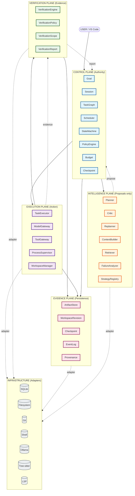

**Nguyên tắc:**
- Control Plane là **authority** — không ai bypass.
- Intelligence Plane chỉ **propose**.
- Execution Plane **thực thi** theo policy.
- Verification Plane **chứng minh**.
- Evidence Plane **lưu** mọi thứ.

---

## 2. Control Plane — Authority Detail

Câu hỏi: **Authority nằm ở đâu? Ai quyết định cái gì?**

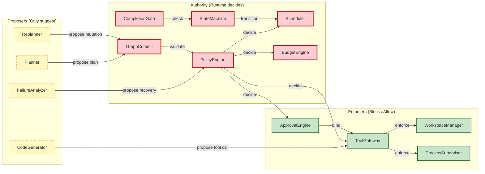

**Nguyên tắc vàng:**
> LLM proposes (dashed). Runtime decides (solid red). Enforcers block (green).

Không có mũi tên nào từ Proposer → Authority mà không qua validation.

---

## 3. Intelligence Plane — Proposal Flow

Câu hỏi: **LLM đề xuất gì, và đề xuất đó đi đâu?**

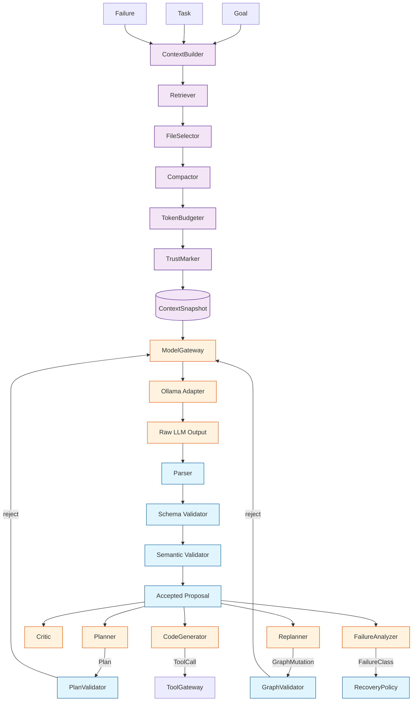

**Điểm chốt:**
- Mọi LLM call qua `ModelGateway`.
- Output qua **3 lớp validation**: parse → schema → semantic.
- Chỉ khi pass → proposal.
- Proposal vẫn phải qua Authority (Control Plane).

---

## 4. Execution Plane — Tool Execution

Câu hỏi: **Tool call được thực thi thế nào và bị chặn ở đâu?**

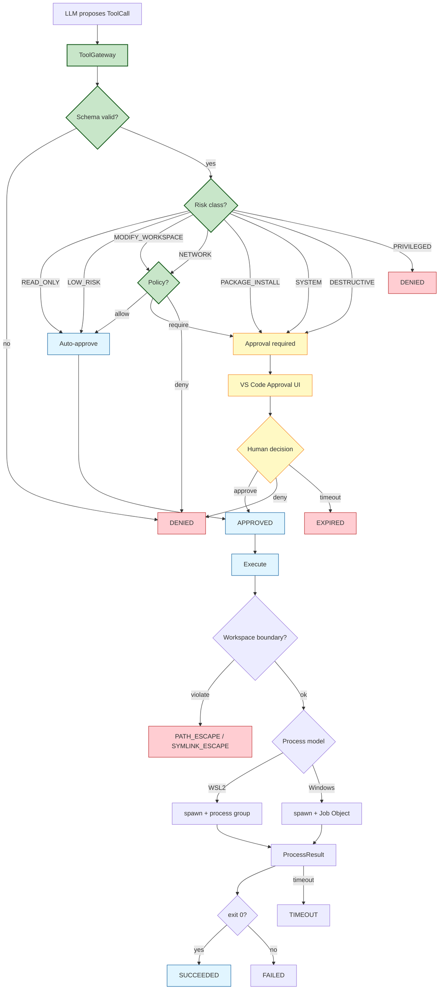

**Điểm chốt:**
- Không có đường nào tới `Execute` mà không qua `Approved`.
- DESTRUCTIVE/PRIVILEGED **không** auto-approve.
- Boundary check **sau** approval, không tin approval.

---

## 5. Verification Plane — Evidence Binding

Câu hỏi: **Verification bind với cái gì và verify cái gì?**

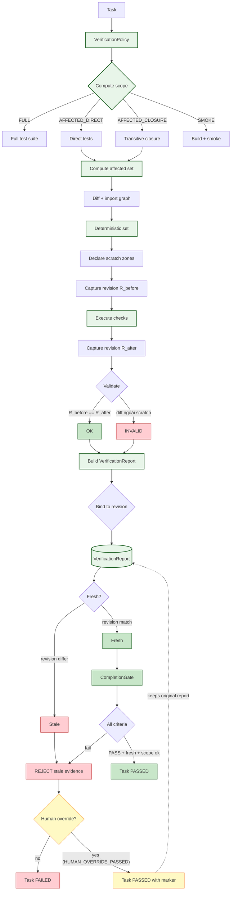

**Điểm chốt:**
- Verification **luôn** bind với `WorkspaceRevision`.
- Mutation ngoài scratch thì INVALID.
- Revision thay đổi thì stale; stale thì không complete.
- Đường vào PASSED không qua verification duy nhất là **human override** (`HUMAN_OVERRIDE_PASSED`): tạo marker `HUMAN_OVERRIDE_COMPLETED`, **không** sửa VerificationReport gốc (VR-005, HI-004). Xem `VERIFICATION_PROTOCOL §11`.

---

## 6. Evidence Plane — Persistence Map

Câu hỏi: **Bằng chứng lưu ở đâu, hình dạng thế nào?**

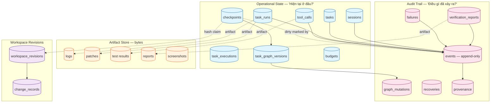

**Điểm chốt:**
- SQLite = **operational state** + **audit trail**.
- ArtifactStore = **bytes** (ngoài SQLite).
- Mọi event append-only.
- Provenance chain: model → context → revision.
- Checkpoint metadata atomic trong SQLite; `workspaceRevision.hash` là **claim** về filesystem (đường nét đứt), không atomic cùng SQLite. Drift lúc capture được đánh dấu bằng event `CHECKPOINT_DIRTY_AT_CAPTURE`. Xem `WORKSPACE_SPEC §10.3`, CP-010..CP-012.

---

## 7. Dependency Direction

Câu hỏi: **Layer nào được import layer nào?**

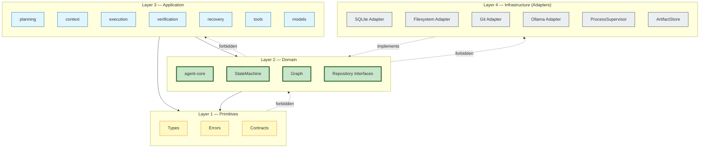

**Nguyên tắc:**
- `-->` = allowed import.
- `-.x.->` = **forbidden** import (CI enforce qua dependency-cruiser).
- Domain (L2) **không** import app (L3) hay infra (L4).
- Infrastructure (L4) chỉ **implements** interface từ domain.

Tham chiếu: `INVARIANTS.md` → **DC-001..DC-005**.

---

## 8. Trust Boundary

Câu hỏi: **Cái gì trusted, cái gì không?**

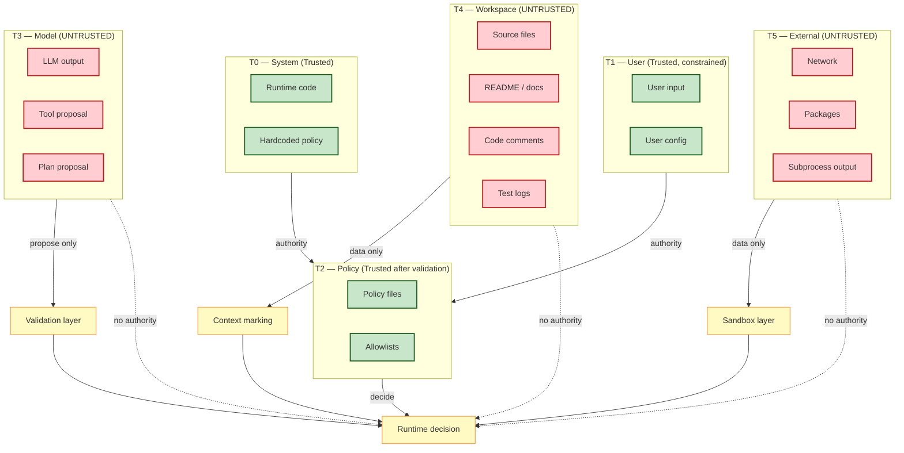

**Nguyên tắc:**
- `T0/T1/T2` = trusted → có authority.
- `T3/T4/T5` = untrusted → **chỉ data**, không authority.
- Mọi untrusted phải qua validation/sandbox **trước khi** ảnh hưởng decision.

Tham chiếu: `SECURITY_MODEL.md` → §1, §3.

---

## 9. Planning Flow

Câu hỏi: **Goal → Graph ra sao?**

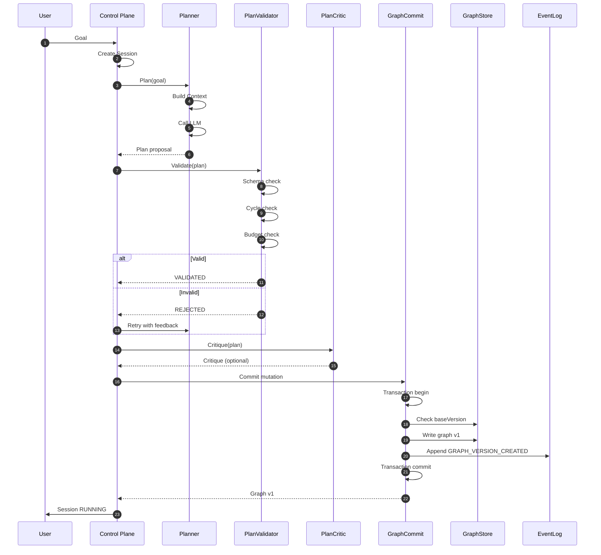

**Điểm chốt:**
- Planner **không** commit graph.
- Validator **deterministic**.
- Critic chỉ **góp ý**, không authority.
- Commit atomic.

---

## 10. Execution Flow — Task Lifecycle

Câu hỏi: **Task → PASSED ra sao?**

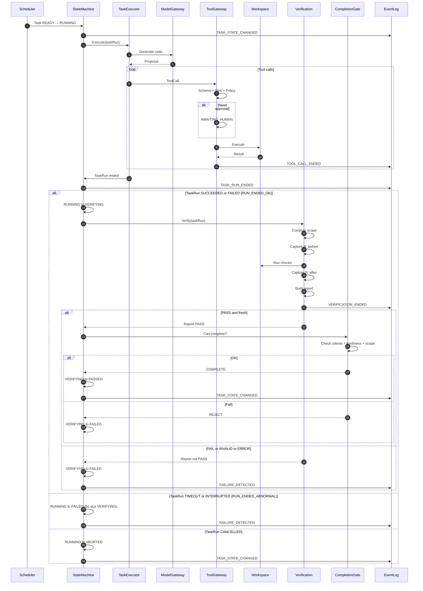

**Điểm chốt:**
- Không có đường tắt từ RUNNING sang PASSED.
- TaskRun SUCCEEDED/FAILED đi qua VERIFYING; TIMEOUT/INTERRUPTED đi thẳng FAILED (bỏ verify vô nghĩa); CANCELLED sang ABORTED. Xem `STATE_MACHINE_SPEC §4.3, §13.2`.
- Verification bind với revision.
- Completion qua gate. Đường vào PASSED không qua verification duy nhất là human override (`HUMAN_OVERRIDE_PASSED`, xem Diagram 5).

---

## 11. Recovery Flow — Failure → Action

Câu hỏi: **Failure được xử lý thế nào?**

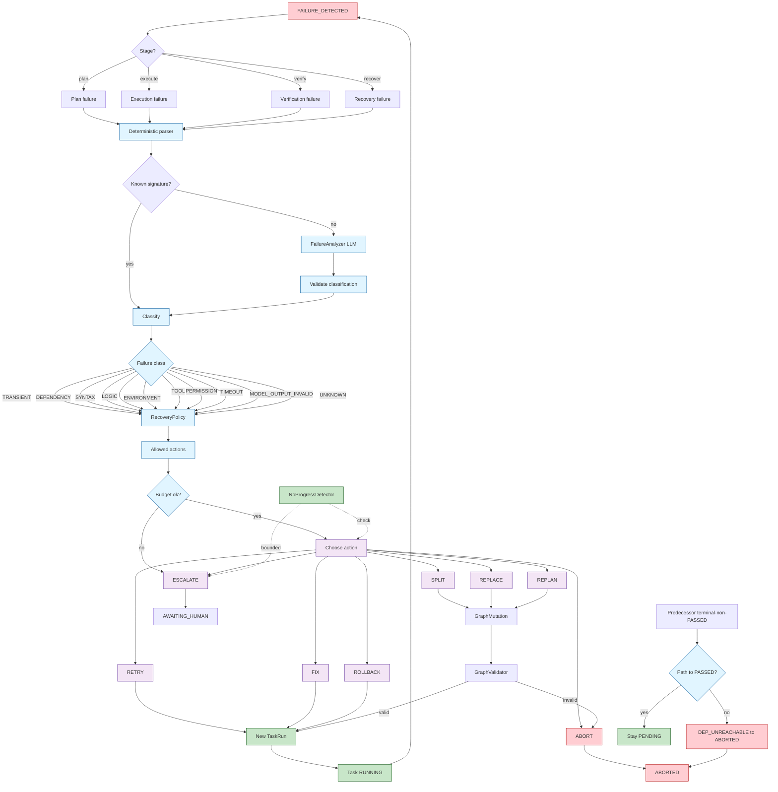

**Điểm chốt:**
- Recovery **bounded** (budget + policy).
- UNKNOWN không retry vô hạn.
- NoProgressDetector **deterministic** trên tập tín hiệu khả dụng tại phase hiện tại; tín hiệu chưa có (ví dụ `relevantFilesChanged` trước Phase 6) coi là unknown, không gây báo no-progress sai (RC-003).
- Replan tạo **mutation**, không overwrite graph.
- Task PENDING có predecessor terminal-non-PASSED và không còn path đạt PASSED thì chuyển **ABORTED** qua `DEP_UNREACHABLE` (không kẹt vô hạn; SM-L8). Đây là điều kiện graph, không phải failure của một run.

---

## 12. Full Lifecycle Sequence

Câu hỏi: **Một session chạy từ đầu đến cuối thế nào?**

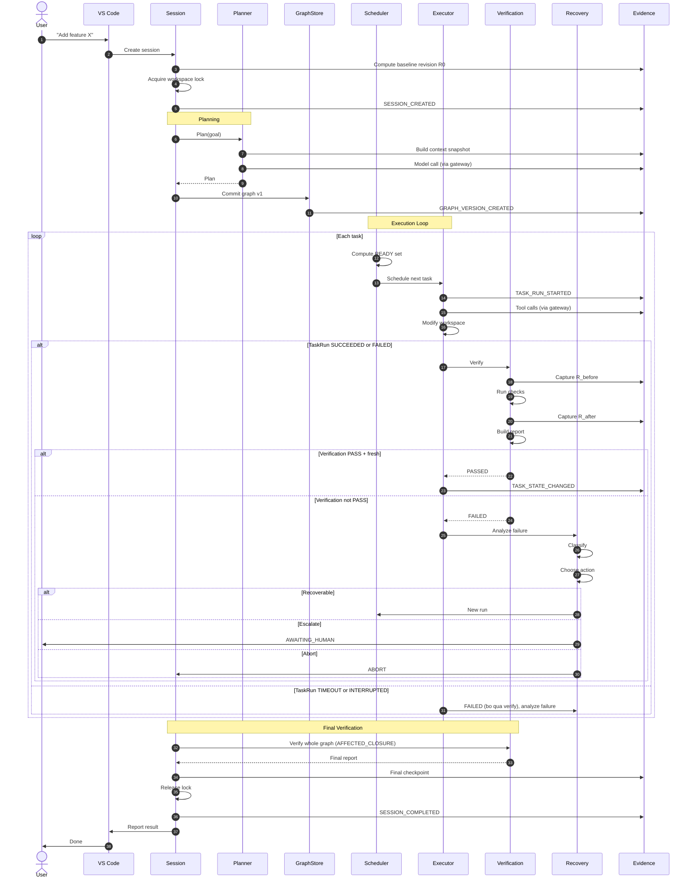

**Điểm chốt:**
- Session giữ workspace lock suốt.
- Mọi action đi qua Control Plane.
- Evidence ghi ở mọi bước.
- Final verification là bước cuối.

---

## 13. Bonus — Invariant Enforcement Map

Câu hỏi: **Mỗi invariant được enforce ở đâu?**

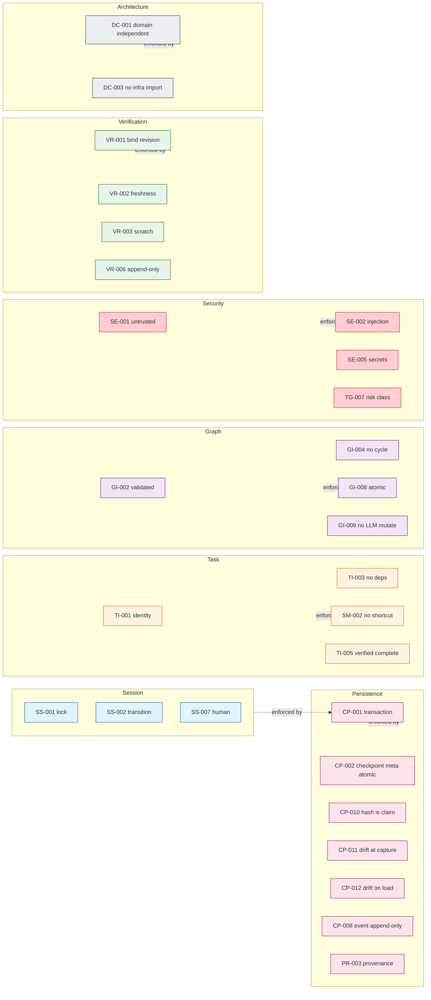

---

## 14. Ghi chú kỹ thuật

### 14.1 Render Mermaid

**VS Code:**
```bash
code --install-extension bierner.markdown-mermaid
```

**GitHub:** render tự động trong `.md` files.

**GitLab:** render tự động.

**Obsidian:** render tự động.

**Export PNG/SVG:**
```bash
npx @mermaid-js/mermaid-cli -i ARCHITECTURE_DIAGRAMS.md -o diagrams/
```

### 14.2 Convention

| Ký hiệu | Nghĩa |
|---|---|
| `-->` | Luồng bình thường |
| `-.->` | Proposal / adapter / non-authority |
| `-.x.->` | **Forbidden** (không được phép) |
| `(( ))` | Terminal / user |
| `[( )]` | Storage |
| `[ ]` | Component |
| `{ }` | Decision |
| `[[ ]]` | Subroutine |

### 14.3 Color palette

| Color | Meaning |
|---|---|
| 🟦 Xanh dương nhạt | Control Plane |
| 🟧 Cam nhạt | Intelligence Plane |
| 🟪 Tím nhạt | Execution Plane |
| 🟩 Xanh lá nhạt | Verification Plane |
| 🟥 Hồng nhạt | Evidence Plane |
| ⬜ Xám nhạt | Infrastructure |
| 🟥 Đỏ | Deny / reject |
| 🟨 Vàng | Human / approval |
| 🟩 Xanh đậm | Success |

### 14.4 Cập nhật diagram

Khi architecture thay đổi:

1. Update spec tương ứng.
2. Update diagram trong file này.
3. Bump version.
4. Ghi change log.

### 14.5 Change log

| Version | Ngày | Thay đổi |
|---|---|---|
| 1.0 | (baseline) | 13 diagrams ban đầu. |
| 1.1 | 2026-09-14 | **Sửa lỗi render:** thay cú pháp cạnh không hợp lệ `-.x.->` (Diagram 7, 8) và `classDef graph` (từ reserved, Diagram 13) bằng cú pháp hợp lệ; chuẩn hóa nhãn dotted link nhiều từ thành `-. text .->`. Bỏ emoji/em-dash trong subgraph title Diagram 1, 2 và thêm init spacing cho dễ đọc. **Đồng bộ nội dung với spec sau các bản vá:** Diagram 5 thêm nhánh human override (`HUMAN_OVERRIDE_PASSED`); Diagram 6 phản ánh checkpoint hash-claim + `CHECKPOINT_DIRTY_AT_CAPTURE`; Diagram 10, 12 tách nhánh TaskRun (RUN_ENDED_OK vs RUN_ENDED_ABNORMAL); Diagram 11 thêm `DEP_UNREACHABLE` + graceful degradation NoProgress; Diagram 13 thêm CP-010..012. Đã validate 13/13 diagram bằng mermaid parser. |

---

## 15. North Star

> **Một diagram tốt thay thế 1000 dòng spec. Nhưng nó phải trung thực.**

Mỗi diagram trong file này trả lời một câu hỏi cụ thể:

- **Component nào** tồn tại?
- **Ai** gọi ai?
- **Cái gì** được enforce ở đâu?
- **Đường nào** bị chặn?
- **Bằng chứng** lưu ở đâu?

Và câu hỏi cuối cùng:

> **Nếu một kỹ sư mới nhìn vào diagram này, họ có hiểu ngay LLM không có authority không?**

Nếu có → diagrams đúng.
Nếu không → diagrams cần sửa.

---

